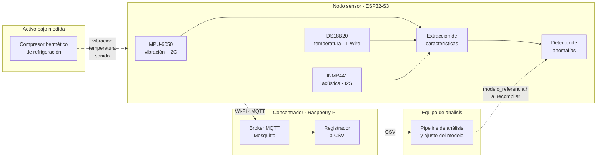
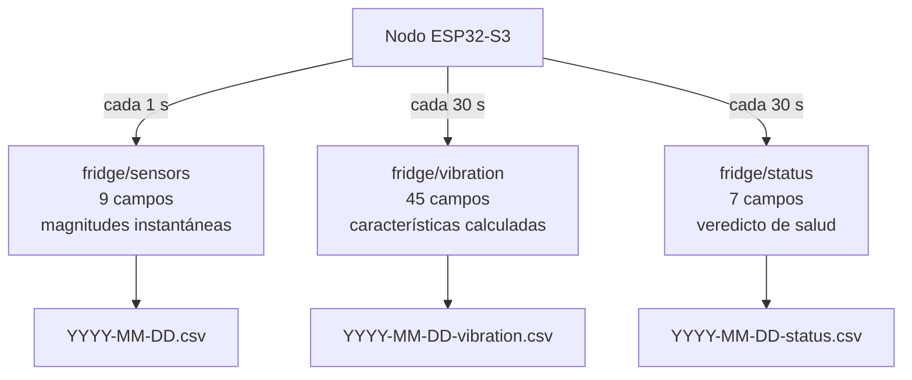
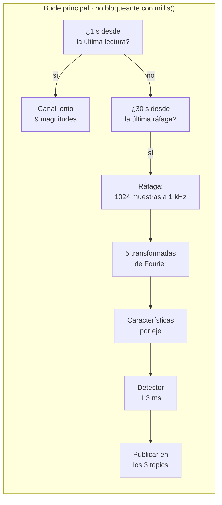
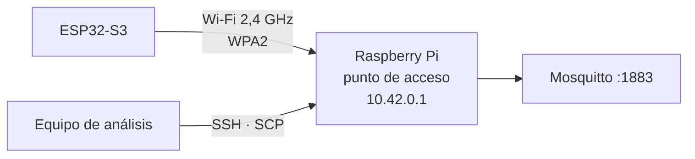

# Arquitectura del sistema

La tesis del trabajo es que **el diagnóstico ocurre en el nodo**. La nube y el concentrador son
soporte de entrenamiento y almacenamiento, no requisito de operación: si se cae el enlace, el
nodo sigue diagnosticando.

La flecha de vuelta es discontinua a propósito: **no es un lazo en tiempo de operación**. El
modelo se ajusta en el equipo de análisis y llega al nodo al recompilar el firmware. El nodo no
consulta nada para diagnosticar.

## Los tres canales

**Por qué tres y no uno.**

El canal lento muestrea a 1 Hz, lo que limita el análisis a frecuencias por debajo de 0,5 Hz.
La vibración del compresor está en torno a los 49 Hz y sus armónicos: a 1 Hz la señal se pliega
y no admite análisis frecuencial. Sirve para tendencias térmicas, no para vibración.

El canal de ráfaga captura 1024 muestras a 1 kHz y publica **las características ya calculadas**,
no la señal. Transmitir 3000 valores por segundo de forma continua sería insostenible, y
calcular en el borde es el planteamiento del proyecto.

El canal de veredicto lleva el diagnóstico. **124 bytes frente a los ~1050 del canal de
características**: quien solo quiera saber el estado del activo recibe un orden de magnitud
menos de tráfico.

## Dos cadencias en el nodo

El bucle **no usa `delay()` largos**, con una excepción deliberada: la captura de la ráfaga
bloquea ~1,02 s. El análisis frecuencial exige muestras equiespaciadas y cualquier trabajo
intercalado introduciría *jitter* en el espectro. Está acotado y muy por debajo del *keepalive*
de MQTT.

La conversión del DS18B20 se solicita de forma **asíncrona**: sus ~750 ms de conversión
detendrían el resto de la adquisición.

## Red

El concentrador **genera su propia red Wi-Fi** (`NetworkManager` en modo compartido, IP fija
10.42.0.1). No depende de un router ajeno.

La decisión no es estética: durante la puesta a punto el DHCP de la red doméstica cambió de
subred cuatro veces, y cada cambio dejaba al nodo publicando contra una dirección que ya no
existía. Con el concentrador como punto de acceso, la dirección del broker es fija por
construcción.

## Presupuesto de cómputo en el nodo

| Recurso | Consumo | Disponible |
| :--- | ---: | ---: |
| Búferes estáticos de ráfaga | 22,9 KiB | 512 KB de SRAM |
| Parámetros del modelo | 31,6 KB | 8 MB de PSRAM |
| Cálculo de características | ~30 ms | ciclo de 30 s |
| **Inferencia** | **1,3 ms** | ciclo de 30 s |

La inferencia ocupa el **0,004 % del ciclo**. El coste de diagnosticar en el borde no es una
restricción con este planteamiento.

Los payloads se construyen con `snprintf` sobre búfer estático y nunca con `String`: el nodo
publica de forma continua durante días y la fragmentación del montón acabaría con él.

## Documentos relacionados

- [Conexionado](Conexionado) — pinout y lista de conexiones
- [Pipeline de análisis](Pipeline-de-analisis) — de los CSV al modelo
- [Trampas conocidas](Trampas-conocidas) — lo que ya ha fallado y por qué
