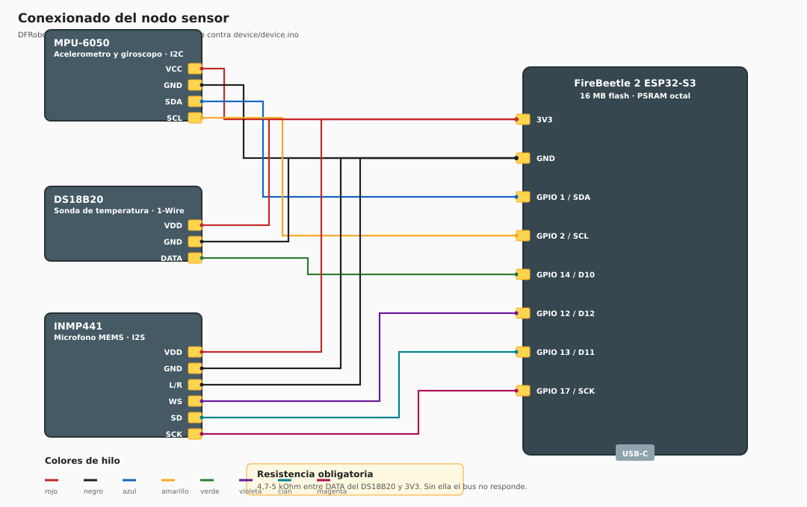

# Conexionado del nodo sensor

Placa: **DFRobot FireBeetle 2 ESP32-S3** (16 MB de flash, PSRAM octal).
Pinout verificado contra las constantes de `device/device.ino`, no contra la documentación.

## Lista de conexiones

Es la tabla que necesita quien monte el cableado. La columna «GPIO» es el número que
aparece en el firmware; la «Serigrafía», la etiqueta impresa en la placa. **No coinciden**, y
confundirlas es el error de montaje más habitual con esta placa.

| # | Origen | Pin | Destino (GPIO) | Serigrafía | Hilo | Bus |
| ---: | :--- | :--- | :--- | :--- | :--- | :--- |
| 1 | MPU-6050 | VCC | 3V3 | 3V3 | rojo | — |
| 2 | MPU-6050 | GND | GND | GND | negro | — |
| 3 | MPU-6050 | SDA | GPIO 1 | SDA | azul | I2C |
| 4 | MPU-6050 | SCL | GPIO 2 | SCL | amarillo | I2C |
| 5 | DS18B20 | VDD | 3V3 | 3V3 | rojo | — |
| 6 | DS18B20 | GND | GND | GND | negro | — |
| 7 | DS18B20 | DATA | GPIO 14 | D10 | verde | 1-Wire |
| 8 | INMP441 | VDD | 3V3 | 3V3 | rojo | — |
| 9 | INMP441 | GND | GND | GND | negro | — |
| 10 | INMP441 | L/R | GND | GND | negro | — |
| 11 | INMP441 | WS | GPIO 12 | D12 | violeta | I2S |
| 12 | INMP441 | SD | GPIO 13 | D11 | cian | I2S |
| 13 | INMP441 | SCK | GPIO 17 | SCK | magenta | I2S |

## Componente pasivo

| Componente | Valor | Entre | Por qué |
| :--- | :--- | :--- | :--- |
| Resistencia | 4,7–5 kΩ | DATA del DS18B20 ↔ 3V3 | El bus 1-Wire es de colector abierto: sin pull-up la línea nunca sube y el sensor no responde |

El MPU-6050 **no** necesita pull-up externo: los módulos comerciales ya los llevan integrados
en la placa del sensor.

## Restricciones de esta placa

Esto es específico del ESP32-S3 y no se puede copiar de un montaje con ESP32 clásico.

| Restricción | Detalle |
| :--- | :--- |
| **GPIO 22 no existe** | El par I2C habitual GPIO21/GPIO22 del ESP32 clásico no sirve aquí |
| **GPIO 21 es el LED** | Corresponde a D13, el LED integrado |
| **GPIO 33–37 reservados** | Los usa la PSRAM octal. No cablear |
| **Pines de *strapping*** | GPIO 0, 3, 45 y 46. Ninguno se usa en este montaje |

Los pines I2C se declaran de forma **explícita** en el firmware (`I2C_SDA`, `I2C_SCL`) en lugar
de confiar en los valores por omisión del fichero de variante de la placa. Es deliberado: el
fichero de variante puede cambiar entre versiones del núcleo y el montaje dejaría de funcionar
sin que nada en el código lo explique.

## Lo que este montaje tiene de provisional

Conviene declararlo porque condiciona los datos.

**La fijación del acelerómetro es adhesiva sobre una superficie curva**, no atornillada. Se
comporta como un acoplamiento elástico y limita la banda en que la medida es fiel. La
frecuencia de resonancia del acoplamiento **no se ha medido**, de modo que el corte del filtro
paso bajo a 150 Hz es una cota conservadora sin verificar.

Aun así transmitió la firma del fallo detectado con amplitud suficiente para identificarla en
el 99 % de las ráfagas, por lo que no impide la detección.

**El conexionado es con conectores desmontables, no soldado.** Los reintentos del bus I2C
crecen de forma apreciable con las horas de vibración, y eso no es solo pérdida de datos:
consultar [Trampas conocidas](Trampas-conocidas) para ver por qué contamina la característica
que decide el diagnóstico.

## Punto de medida

El sensor va en el **tubo de descarga**, no en la cúpula del compresor.

Un compresor hermético lleva el motor suspendido sobre muelles internos, de modo que la cúpula
es el lado amortiguado de esa suspensión. El tubo de descarga está unido rígidamente al cuerpo
de la bomba y transporta la pulsación sin atravesar la suspensión.

| Posición | Valor eficaz | Fundamental identificada |
| :--- | ---: | :--- |
| Cúpula del compresor | 0,047 m/s² | 4 de 52 ráfagas |
| **Tubo de descarga** | **0,35–2,00 m/s²** | **prácticamente todas** |

El cambio elevó el nivel entre 9 y 20 veces según el eje.
