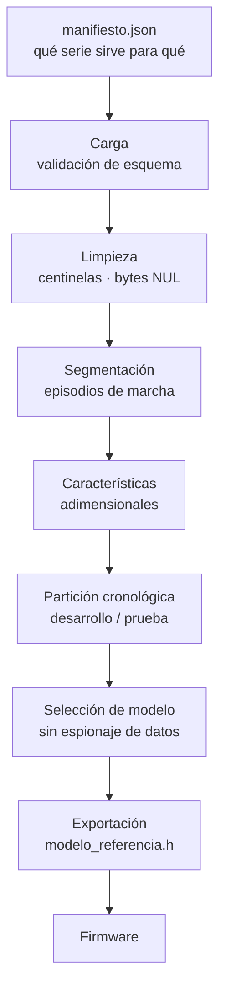
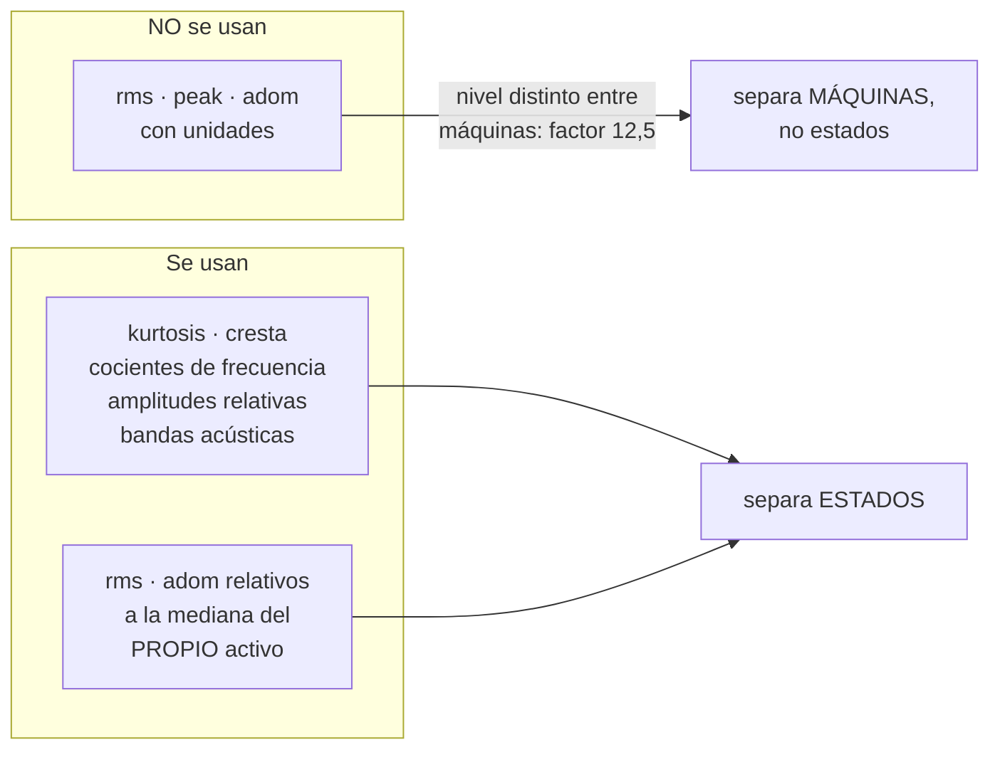
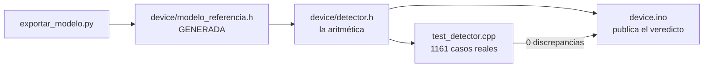

# Pipeline de análisis

De los CSV al modelo embarcado. Los scripts de `server/analisis/` son la fuente de verdad; esta
página explica **por qué** cada etapa es como es.



## 1. Carga con dos candados

Las series se leen del manifiesto, no recorriendo el árbol de directorios. Dos comprobaciones,
ambas probadas:

**Filtro por versión de firmware.** Solo `fw-46col` en el canal de ráfaga. Las versiones
anteriores publican `rms`, `peak` y `kurt` sin filtrar y un único pico espectral: son
**definiciones distintas de la misma magnitud** y mezclarlas no significa nada.

**Comprobación del número de columnas de cada fichero.** Es el candado que importa, porque cubre
el caso que ya ocurrió: un fichero con cabecera desalineada dentro de un directorio correcto.
Leído con la cabecera equivocada devuelve `rms_x` = 7 y `aud_b3` = 0,986, valores que un cargador
acepta sin protestar. El pipeline **aborta**, no avisa.

Los canales se identifican por su sufijo de forma **explícita** y no por descarte. El criterio
anterior era «todo lo que no acabe en `-vibration.csv` es canal lento», y al aparecer un tercer
canal se rompió en dos sitios distintos.

## 2. Limpieza

| Qué | Por qué |
| :--- | :--- |
| Bytes NUL | Huecos del sistema de ficheros por parada sucia del concentrador. Van a reaparecer: el registrador vuelca con `flush()`, no con `fsync()` |
| `tempExt` = −127 | Centinela del DS18B20 sin responder. Un solo valor arrastra la media térmica de la jornada |
| `motorTemp` = 0 | Lectura del acelerómetro fallida |
| Marcas de tiempo duplicadas | Aparecen al consolidar fragmentos de varias descargas |

Los **reinicios del nodo** se detectan por el retroceso de un contador acumulado. La fila se
marca pero **no se descarta**, y deliberadamente **no corta un episodio**: un reinicio interrumpe
la observación, no la marcha del compresor.

## 3. Segmentación: el episodio es la unidad de observación

Las ráfagas salen cada 30 s. Las de un mismo episodio de marcha describen la misma condición y
están fuertemente correlacionadas.

> **623 ráfagas de un único arranque de 5 h no son 623 observaciones.** Son una condición medida
> 623 veces. Cualquier métrica calculada como si lo fuesen sobreestima la evidencia en un orden
> de magnitud.

El umbral marcha/parada **se deriva de los datos**, separando los dos modos del logaritmo del
valor eficaz. Sin hiperparámetros.

No puede ser un valor absoluto: el valle está en 0,199 m/s² en un activo y en 0,060 en el otro.
El primer valor que se usó, 0,05, se fijó con 1,88 h de datos y **caía dentro del grupo de
parado**, produciendo episodios espurios de una sola ráfaga.

## 4. Características adimensionales



**El hallazgo que gobierna el diseño:** un detector sobre `rms`, `peak` y `kurt` alcanza el
99,4 % de detección **sin haber empleado ninguna característica que contenga la firma del
fallo**. El nivel de los dos activos difiere en un factor 12,5, así que separa las dos máquinas
y no el estado de una de ellas. Es una métrica excelente obtenida sobre el atributo equivocado.

**Y su coste, que hubo que corregir:** las características puramente adimensionales son ciegas
por construcción a un fallo que solo cambie el nivel, porque todo se expresa como cociente
respecto de la fundamental. La solución es normalizar por la mediana del **propio** activo:
adimensional en la forma, específica en el valor.

### Los picos se ordenan por frecuencia, no por amplitud

El firmware los publica ordenados **por amplitud**. Con esa ordenación los cocientes no son
estables: en el activo con fallo el armónico supera a la fundamental por un 2 % en el 9 % de las
ráfagas y le arrebata la posición de dominante. El mismo fenómeno físico daba **9,0 en unas
ráfagas y 0,111 en otras**.

Hacen falta las dos condiciones: descartar los picos con amplitud inferior al 20 % de la mayor,
y ordenar por frecuencia los que quedan. Con ambas, el coeficiente de variación de la
fundamental es del 0,12 %.

## 5. El filtro de calidad es parte del detector

No es limpieza previa. **Los reintentos del bus I2C fabrican la firma del fallo sobre un activo
sano.**

| Reintentos | Ráfagas | Con más de un pico | Fundamental estimada |
| ---: | ---: | ---: | ---: |
| 0 | 261 | 0,4 % | 49,15 Hz |
| 1–3 | 206 | 0,5 % | 49,17 Hz |
| 4–5 | 53 | 8 % | 49,25 Hz |
| 6–10 | 48 | 31 % | 49,16 Hz |
| 11–20 | 46 | **93 %** | **20,03 Hz** |
| > 20 | 69 | **94 %** | **16,03 Hz** |

Una muestra corrupta inyecta ruido de banda ancha y varios coeficientes del espectro superan el
umbral de significación.

**Consecuencia para el nodo:** debe **negarse a emitir veredicto** con más de 3 reintentos, en
lugar de juzgar.

## 6. Selección de modelo sin espionaje de datos

El análisis inicial elegía características ordenándolas por su separación **frente al conjunto
con fallo**, es decir usando el conjunto de evaluación para decidir el diseño.

| | |
| :--- | :--- |
| **Permitido** | Cualquier decisión sobre el conjunto **nominal**. Conocimiento previo del dominio. Perturbaciones **sintéticas** del nominal |
| **Prohibido** | Ordenar o descartar características por su comportamiento sobre el fallo. Ajustar umbrales mirando la detección. Repetir la evaluación final |

Partición **cronológica por episodios**, no aleatoria: una partición aleatoria reparte episodios
contiguos entre los dos lados y filtra información del futuro.

```
desarrollo   16 episodios más antiguos   →  todas las decisiones
prueba        8 episodios más recientes  →  se mira UNA vez
```

Resultado: **7,8 % de falsos positivos** sobre episodios nunca vistos y **100 % de detección**.

Y el protocolo limpio **elige un modelo distinto** del que se había elegido a mano. Esa
discrepancia es la evidencia de que la elección anterior estaba contaminada.

## 7. Exportación al firmware



La separación entre los parámetros y la aritmética es deliberada: **reentrenar no debe obligar a
tocar código**. La cabecera generada lleva anotada la campaña, la duración, el número de
ráfagas y episodios, el filtro de calidad y la fecha, de modo que cualquier firmware programado
en una placa se puede rastrear a los datos que lo produjeron.

## Cómo se ejecuta

```bash
pip install -r server/requirements-analisis.txt

python server/analisis/pipeline.py            # qué datos hay y qué se descarta
python server/analisis/comparar_modelos.py    # 7 modelos y validación por episodios
python server/analisis/cobertura_modos.py     # puntos ciegos (datos SINTÉTICOS)
python server/analisis/protocolo.py           # selección sin espionaje de datos
python server/analisis/exportar_modelo.py     # -> device/modelo_referencia.h
python server/analisis/verificar_nodo.py      # ¿coincide el nodo con el análisis?
```

## Documentos relacionados

- [Trampas conocidas](Trampas-conocidas) — las nueve que ya se han pisado
- [Arquitectura](Arquitectura)
