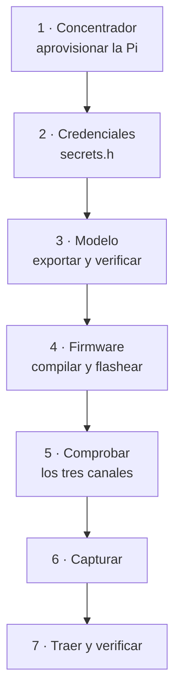

# Puesta en marcha

Procedimiento completo, del repositorio a un nodo diagnosticando. Los comandos son literales.



## 1. Concentrador

```bash
sudo ./server/provision-pi.sh todo
```

Instala Mosquitto, el registrador como servicio, y configura la Pi como **punto de acceso**
Wi-Fi con IP fija 10.42.0.1. Detecta solo el usuario y el directorio del proyecto.

Tras un corte de corriente todo arranca por sí mismo.

## 2. Credenciales del nodo

```bash
cp device/secrets.h.example device/secrets.h
```

Rellenar con el SSID que genera la Pi y `MQTT_SERVER = "10.42.0.1"`.

> `device/secrets.h` está en `.gitignore` y **nunca** debe versionarse.

## 3. Modelo

```bash
pip install -r server/requirements-analisis.txt

python server/analisis/exportar_modelo.py        # -> device/modelo_referencia.h
python server/analisis/exportar_casos_prueba.py  # -> device/test/casos_modelo.h
```

Y verificar en el equipo de desarrollo **antes** de gastar un ciclo de programación:

```bash
g++ -std=c++11 -O2 -o /tmp/td device/test/test_detector.cpp    && /tmp/td
g++ -std=c++11 -O2 -o /tmp/ti device/test/test_integracion.cpp && /tmp/ti
g++ -std=c++11 -O2 -o /tmp/ts device/test/test_signal_processing.cpp && /tmp/ts
```

Los tres deben terminar con `Fallos: 0`. El primero contrasta el detector contra la
implementación de referencia sobre **1161 ráfagas reales**.

> **El modelo es específico del activo.** Lleva las medianas y el umbral de marcha de la máquina
> sobre la que se ajustó. Programarlo en un nodo instalado en otro activo produce
> `not_evaluable` en el 100 % de las ráfagas. Cada nodo necesita su propia campaña de referencia.

## 4. Firmware

```bash
brew install arduino-cli
arduino-cli core install esp32:esp32
arduino-cli board list

FQBN='esp32:esp32:dfrobot_firebeetle2_esp32s3:PSRAM=opi,FlashSize=16M,PartitionScheme=app3M_fat9M_16MB'
arduino-cli compile --fqbn "$FQBN" device/
arduino-cli upload  --fqbn "$FQBN" -p /dev/cu.usbmodem101 device/
arduino-cli monitor -p /dev/cu.usbmodem101 -c baudrate=115200
```

El puerto USB-CDC **cambia entre reinicios**: comprobarlo con `board list` cada vez.

En el monitor debe aparecer al arrancar:

```
Detector: 14 caracteristicas, veredicto en fridge/status
```

> **No reflashear con una campaña de captura en curso** si el cambio afecta al payload de
> ráfaga: cambiaría la cabecera del CSV y partiría la serie en dos conjuntos no comparables.

## 5. Comprobar

```bash
./server/provision-pi.sh comprobar
```

Verifica el punto de acceso, el nodo asociado, el broker, los tres canales en vivo, y **que el
registrador conoce los tres topics**. Esa última comprobación existe porque su ausencia es
silenciosa: el nodo publica y el dato se pierde sin que nada proteste.

O a mano:

```bash
mosquitto_sub -h 10.42.0.1 -t 'fridge/#' -v
```

| Estado | Significado |
| :--- | :--- |
| `nominal` | El activo se comporta como la referencia |
| `anomaly` | Desviación detectada |
| `not_evaluable` | **La medida no sirve para decidir.** Compresor detenido, o más de 3 reintentos del bus |

`not_evaluable` no es un estado de salud intermedio, y esas ráfagas no cuentan ni rompen la
histéresis.

## 6. Capturar

Dejarlo correr. La Pi va escribiendo los tres CSV y sobrevive a cortes de corriente.

**Dimensionar la campaña sobre las ráfagas útiles, no sobre la cadencia.** Una hora rinde ~23
ráfagas utilizables: el compresor está en marcha el 36 % del tiempo y una ráfaga con el
compresor detenido no contiene vibración que analizar.

| Objetivo | Duración |
| :--- | :--- |
| Comprobar que la cadena funciona | 1 h |
| Referencia mínima defendible | **12 h** (~8 episodios de marcha) |
| Referencia holgada | 21 h (~24 episodios) |

Lo que **no** se puede acortar es la cobertura de ciclos de marcha y parada: son fenómenos de
tiempo de reloj. La unidad de observación independiente es el **episodio**, no la ráfaga.

## 7. Traer y verificar

```bash
./server/traer-datos.sh 10.42.0.1 <usuario> nodo-a-nevera-buena/fw-46col
python server/analisis/verificar_nodo.py
```

El primero copia con `scp` —sin opción de borrado, no puede vaciar nada—, consolida por marca de
tiempo y es idempotente: traer dos veces los mismos datos no duplica filas.

El segundo responde a tres preguntas:

1. **¿Coincide el nodo con el análisis?** Cruza los dos canales por marca de tiempo, recalcula la
   puntuación con **el modelo que lleva la placa** y compara. Misma ráfaga, dos implementaciones.
2. **¿Cuántos avisos?** Cuenta `notify`, no `health`. La diferencia son dos órdenes de magnitud:
   el 5 % de ráfagas marcadas se traduce en **cero avisos** porque son aisladas y la histéresis
   exige tres consecutivas.
3. **¿Cuánto tarda la inferencia?** 1,3 ms medidos en la placa: el 0,004 % del ciclo.

## Diagnóstico

| Síntoma | Causa probable |
| :--- | :--- |
| El script de sincronización pide contraseña | El usuario es el equivocado. Los concentradores del proyecto no comparten usuario |
| No aparece `*-status.csv` | El registrador no está suscrito a `fridge/status`. Sincronizar y comprobar |
| Todo sale `not_evaluable` | El modelo es de otro activo, o el compresor está parado |
| Un contador acumulado retrocede | Reinicio del nodo. Revisar la alimentación: `vcgencmd get_throttled` |
| Bytes NUL en un CSV | Parada sucia del concentrador. El pipeline los retira al leer |
| `total_retries` crece rápido | Conexionado flojo. Consultar [Trampas conocidas](Trampas-conocidas), punto 5 |

## Documentos relacionados

- [Conexionado](Conexionado)
- [Arquitectura](Arquitectura)
- [Pipeline de análisis](Pipeline-de-analisis)
- [Trampas conocidas](Trampas-conocidas)
